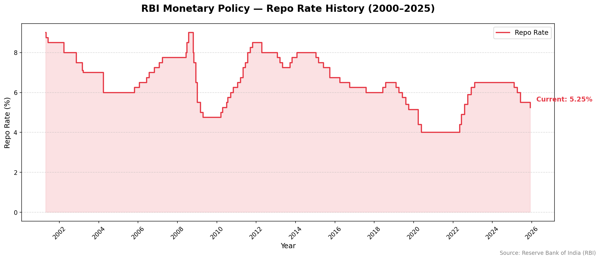
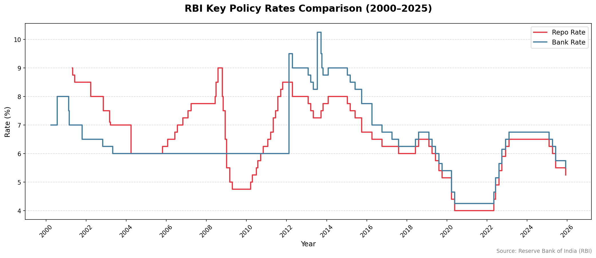

# 🏦 RBI Monetary Policy Tracker

A Python tool that loads, cleans, and visualizes **90 years of Reserve Bank of India (RBI) monetary policy data** — including Repo Rate, Bank Rate, and key policy decisions from 1935 to 2025.

---

## 📊 Charts

### Repo Rate History (2000–2025)


### Key Policy Rates Comparison (2000–2025)


---

## 🔍 What This Shows

- **2008 spike** → RBI tightened aggressively during the Global Financial Crisis
- **2020 crash** → COVID-19 emergency cuts brought repo rate to historic low of 4%
- **2022–23 hike** → Rapid tightening cycle to fight post-COVID inflation
- **2025 easing** → Current rate cut cycle, repo rate at **5.25%** (as of Dec 2025)

---

## 🚀 How to Run

### 1. Clone the repo
```bash
git clone https://github.com/baalu-avr/rbi-policy-tracker-app.git
cd rbi-policy-tracker
```

### 2. Create virtual environment
```bash
python -m venv venv
venv\Scripts\activate      # Windows
source venv/bin/activate   # Mac/Linux
```

### 3. Install dependencies
```bash
pip install -r requirements.txt
```

### 4. Run the tracker
```bash
python main.py
```

---

## 📁 Project Structure

```
rbi-policy-tracker/
│
├── main.py              ← Entry point
├── requirements.txt
├── README.md
│
├── data/
│   └── rates.xlsx       ← Official RBI data (DBIE portal)
│
├── src/
│   ├── fetcher.py       ← Loads & cleans RBI Excel data
│   └── visualizer.py   ← Generates policy rate charts
│
└── output/
    └── charts/          ← Generated PNG charts
```

---

## 🛠️ Tech Stack

- **Python 3.13**
- **pandas** — data loading and cleaning
- **matplotlib** — chart generation
- **openpyxl** — Excel file reading

---

## 📦 Data Source

Official RBI monetary policy rates sourced from the **[RBI Database of Indian Economy (DBIE)](https://data.rbi.org.in)** — the primary source for all RBI macroeconomic data.

---

## 🔮 Roadmap

- [ ] Add CPI inflation overlay on repo rate chart
- [ ] Auto-scrape latest RBI press releases
- [ ] Sentiment analysis on MPC meeting minutes
- [ ] Next MPC meeting countdown

---

## 👤 Author

Built by **Balaji** — connect on [LinkedIn](https://www.linkedin.com/in/balaji-k-58a3932ab) | [GitHub](https://github.com/baalu-avr)